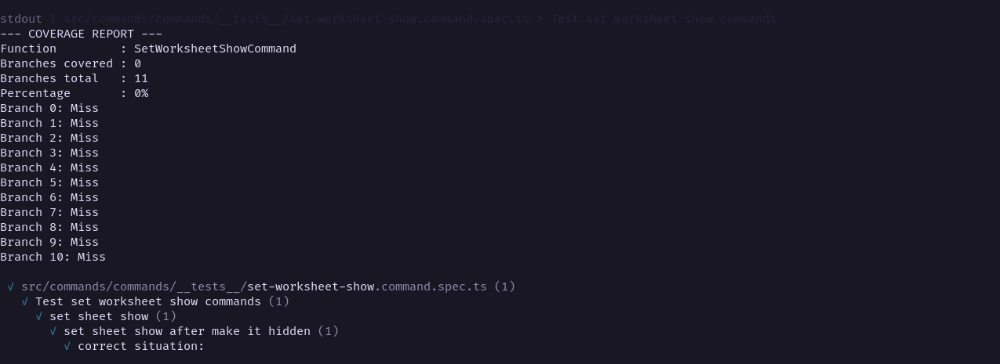
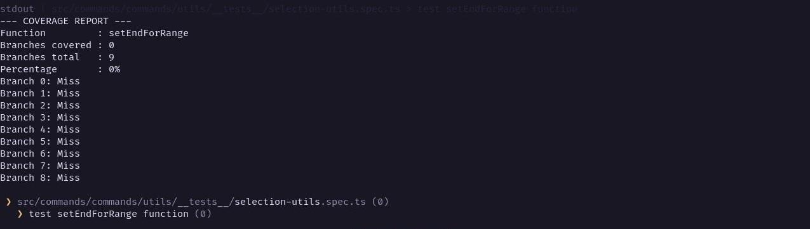
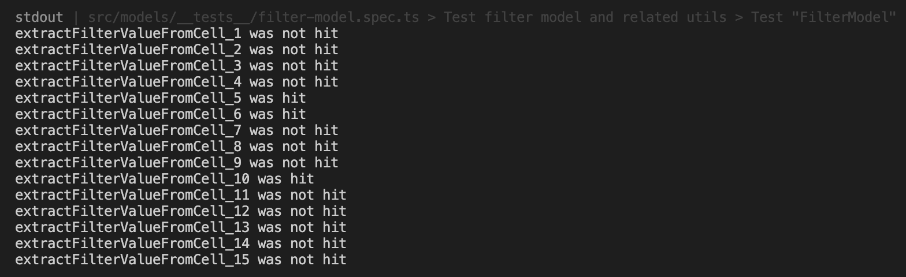
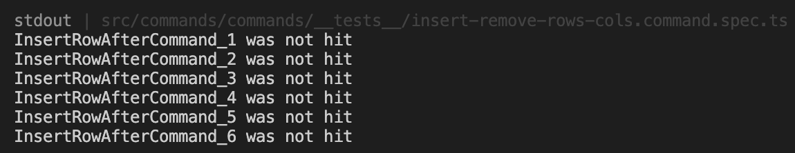
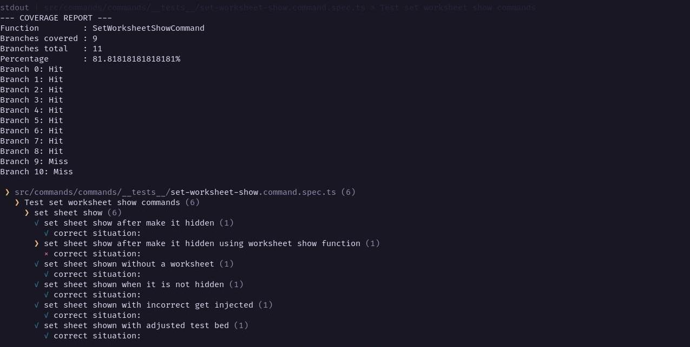
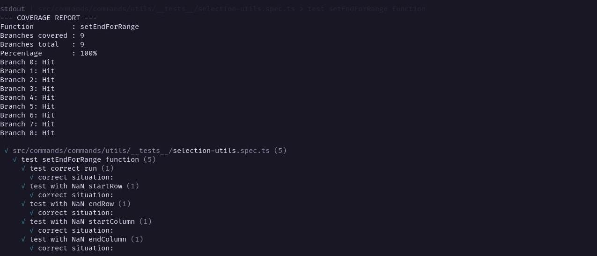
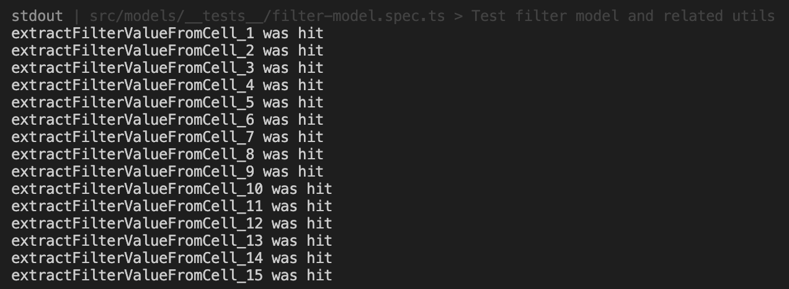
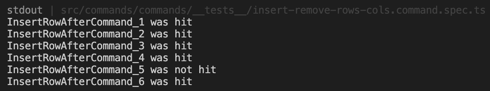

# Report for Assignment 1

## Project chosen

Name: Univer

URL: [https://github.com/dream-num/univer](https://github.com/dream-num/univer)

Number of lines of code and the tool used to count it: 226237 counted through Lizard

Programming language: Typescript

## Coverage measurement

### Existing tool

<Inform the name of the existing tool that was executed and how it was executed>

The project is compiled with `vite` , and the test tool `vitest` is able to generate a local coverage report. By executing `pnpm run coverage`, the package.json calls `Turbo`, which calls `vitest run --coverage` for each package. Turbo is the management tool to compile the different packages of this repository into a single product.
    
As this repository is a mono repository, each package generates their own report. To get a global report, we have implemented a script called `merge-coverage.cjs`. This script copies all the local `coverage-final.json` into a `coverage/.nyc_output` folder, as `{package}-coverage.json`. Finally it calls `nyc report --reporter=html --reporter=text-summary`. This generates the same report as each `vitest run --coverage`, but as it contains all the coverage overviews, it will generate the report for the global coverage.
    
<Show the coverage results provided by the existing tool with a screenshot>
    

### Your own coverage tool

<The following is supposed to be repeated for each group member>

#### Jari Roossien

#### getFormulaItemBySId

##### Implementation Commit
https://github.com/JariRoossien/univer/commit/ef90d965ead24dd295f9bea6e39dbd83ec3ed538

##### Branch Result

#### clearPreviousArrayFormulaCellData

##### Implementation Commit
https://github.com/JariRoossien/univer/commit/50c0accdc9a46b093bb0114481c3325fc2f9cfb7

##### Branch Result

                        
#### Team Member: Sanjay Chacku Purakal

##### SetWorksheetShowCommand()

[Github Commit](https://github.com/JariRoossien/univer/tree/521c2d1cff201c2bf9c4495505c0dfc7b1f9d5f5)

##### setEndForRange()

[Github Commit](https://github.com/JariRoossien/univer/tree/dc771281840c7e80bec107ee43dcbe9f70103f76)

                        
                        
#### Team member: Chantal Ariu

##### Function 1: extractFilterValueFromCell

Link to commit: https://github.com/dream-num/univer/commit/e402af0b9c40e783b7c13e0542fe1cd0f4bfd2f4

Coverage tool results:

Out of the 15 branches, only 3 were hit with unchanged tests, meaning the coverage for this function is at 20%.

##### Function 2: InsertRowAfterCommand

Link to commit: https://github.com/dream-num/univer/commit/e3401afbd670d59a3f5052254282f1fcfe9a0ce1

Coverage tool results:

With the current tests, none of the 6 branches were hit, resulting in 0% coverage.

## Coverage improvement

### Individual tests

<The following is supposed to be repeated for each group member>

### Team Member: Sanjay Chacku Purakal

#### SetWorksheetShowCommand()

[Github Commit](https://github.com/JariRoossien/univer/tree/9bfd026c8a5d9e96685a9c6cb22008c086ddfdca)

##### Before

##### After

The code coverage has been improved from 0% (0/11 branches) to 81.82% (9/11 branches).
The coverage has been improved by considering many edge cases and ensuring all cases in which a program can fail are tested.
For this some test cases had to be specifically constructed since the test case should only fail if another part of the program malfunctions or is changed. To emulate this, flawed inputs where constructed artificially and the brach coverage was achieved by the program catching those exceptions and handling them appropriately.

#### setEndForRange()

[Github Commit](https://github.com/JariRoossien/univer/tree/13d355d6ee7ef0388dc3159525270a4e6492a288)

##### Before

##### After

The code coverage has been improved from 0% (0/9 branches) to 100% (9/9 branches).
The function is intended to replace NaN values in a range with the extremes (0 or max - 1). For this purpose the tests supply a NaN value in ecah of the possible positions. The branch coverage is then achieved by the program handling all NaN values and replacing them with the correct default values.

### Team member: Chantal Ariu

#### Function 1: extractFilterValueFromCell
Link to commit: https://github.com/dream-num/univer/commit/95055e3b2f22a5597a4ab7f22d16ea747d545a40 

Coverage before improvement:

Coverage after improvement:

<State the coverage improvement with a number and elaborate on why the coverage is improved>
The coverage improvement is 80%, since the coverage started out at 20% and is now 100%. The way this was done was by creating tests that hit every branch.

#### Function 2: InsertRowAfterCommand
Link to commit: https://github.com/dream-num/univer/commit/b6afab73e679a01dc610f3fe051e68e742c9aaa1

Coverage before improvement:

Coverage after improvement:

The coverage improved by 83.3%, since in the beginning 0 branches were covered by the tests and after the improvements were made, 5 out of the 6 branches were hit. This was also done by writing tests that hit the branches.

### Overall

<Provide a screenshot of the old coverage results by running an existing tool (the same as you already showed above)>

#### Old Coverage

<Provide a screenshot of the new coverage results by running the existing tool using all test modifications made by the group>

#### New Coverage

Improvements made:
- +0.27% statement coverage
- +0.31% branch coverage
- +0.15% function coverage
- +0.27% line coverage

## Statement of individual contributions

<Write what each group member did>
